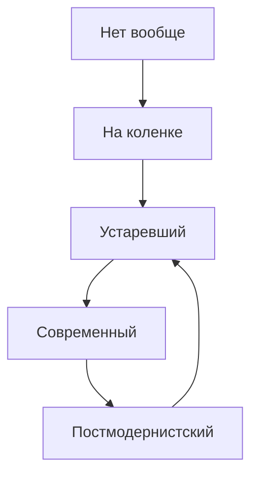

# Через тернии к постмодернистскому CI/CD

---
layout: intro
---

# CI/CD - многогранен

Его аспекты затрагивают всех участников разработки

---

# Что хочется разработчикам

- Не думать, как собрать и задеплоить код
- Видеть, когда код не собрался или не задеплоился
- Знать почему

---

# Что хочется девопсам

- Понятных и простых пайплайнов
- Наблюдаемых билдов
- Повторяемых билдов
- Легкости внесения изменений

---

# Что хочется безопасникам

- Безопасных билдов
- Безопасной инфраструктуры

---

# Что хочется руководителям

- Метрик билдов
- Быстроты онбординга нового человека

---
layout: two-cols-content
---

# Характеристики сферического CI/CD в вакууме

Которые в совокупности дают желаемое

::left::

- Автоматизация
- Наблюдаемость
- Конвергентность
- Идемпотентность
- Детерминизм
- Безопасность
- Аудит

::right::

- Automation
- Observability
- Convergence
- Idempotence
- Determinism
- Security
- Audit

<!-- Конвергентность в плане единообразия как внутри организации,
 так и относительно мейнстрима -->

---
layout: section
---

# А как оно вообще бывает

---

# CI и CD

TODO: Что есть одно, а что другое

---
layout: two-cols-content
---

# А как оно вообще бывает с CI/CD

::left::

1. Нет вообще
2. Сделано на коленке, лишь бы было
3. Устаревший
4. Современный
5. Постмодернистский

::right::

---

# Нет вообще
 

**Оправдано**:

- Одноразовый мини-проект без поддержки
- Ранняя стадия проекта

 
 
 
 

**Иначе** - боль с каждым коммитом и релизом

---

# Сделано на коленке
 

**Оправдано**:

- Ранняя стадия проекта

 
 
 
 

**Иначе** - технический долг

---

# Устаревший CI
Что

1. Техдолг
1. Старые технологии
   - bash скрипты
1. Сборка кода в устаревшие артефакты
   - голые deb, jar, бинари, статика, etc

---

# Устаревший CI
Почему

- Технологии развиваются
- Рынок развивается вместе с технологиями
- Пожалейте новых людей, которые будут с этим разбираться
- Пожалейте старых людей, которые будут это поддерживать

---

# Устаревший CI
Как

- Следить за мейнстримом и технологиями
  - **Но исключить CV driven development**
- Работать с техдолгом в CI/CD как с техдолгом в коде
  
---

# Устаревший CD
Что

1. Техдолг
1. Старые технологии
   - bash скрипты, тулы, пулялки, ssh, ftp
2. Деплой устаревших артефактов
   - голые deb, jar, бинари, статика, etc
3. Деплой современных артефактов, но по старому
   - docker по sftp

<!-- Если есть CD как таковой -->

---

---
layout: section
---

# Что хочется разработчикам

---

# Не думать, как собрать и задеплоить код

Автоматизация

---

# Видеть, когда код не собрался или не задеплоился

Наблюдаемость

---

# Знать почему

Наблюдаемость

---
layout: section
---

# Что хочется девопсам

---

# Понятных и простых пайплайнов

---

# Наблюдаемых билдов

---

# Повторяемых билдов

---

# Легкости внесения изменений

---
layout: section
---

# Что хочется безопасникам

---

# Безопасных билдов

---

# Безопасной инфраструктуры

---
layout: section
---

# Что хочется руководителям

---

# Метрики билдов

---

# Быстроты онбординга нового человека

---

# Проблема

- Нет CI/CD как такового
- 
