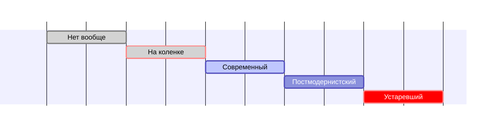

# Через тернии к постмодернистскому CI/CD

---
layout: intro
---

# CI/CD - многогранен

Его аспекты затрагивают всех участников разработки

---

# Что хочется разработчикам

- Не думать, как собрать и задеплоить код
- Видеть, когда код не собрался или не задеплоился
- Знать почему

---

# Что хочется девопсам

- Понятных и простых пайплайнов
- Наблюдаемых билдов
- Повторяемых билдов
- Масштабирования
- Легкости внесения изменений

---

# Что хочется безопасникам

- Безопасных билдов
- Безопасной инфраструктуры

---

# Что хочется руководителям

- Метрик билдов
- Быстроты онбординга нового человека

---
layout: two-cols-content
---

# Характеристики сферического CI/CD в вакууме

Которые в совокупности дают желаемое

::left::

- Автоматизация
- Наблюдаемость
- Конвергентность
- Идемпотентность
- Детерминизм
- Безопасность
- Аудит

::right::

- Automation
- Observability
- Convergence
- Idempotence
- Determinism
- Security
- Audit

<!-- Конвергентность в плане единообразия как внутри организации,
 так и относительно мейнстрима -->

---
layout: section
---

# А как оно вообще бывает

---

# CI и CD

TODO: Что есть одно, а что другое

---

# А как оно вообще бывает с CI/CD

1. Нет вообще
2. Сделано на коленке, лишь бы было
3. Устаревший
4. Современный
5. Постмодернистский

---

# Нет вообще
 

**Оправдано**:

- Одноразовый мини-проект без поддержки
- Ранняя стадия проекта

 
 
 
 

**Иначе** - боль с каждым коммитом и релизом

---

# Сделано на коленке
 

**Оправдано**:

- Ранняя стадия проекта

 
 
 
 

**Иначе** - технический долг

---

# Устаревший
Что

1. Техдолг
1. Старые технологии
   - bash скрипты
1. Сборка кода в устаревшие артефакты
   - голые deb, jar, бинари, статика, etc
1. Деплой устаревших артефактов

<!-- 

Докер стал мейнстримом. В каких-то специфических ситуациях, когда нельзя использовать докер, все норм и можно так делать. Во всех других лучше начать его использовать. Не сегодня, так завтра, ибо это фактически уже стандарт. Намного больше будут знать знать, что делать с докер образами, чем с голыми разрозненными артефактами.
а если еще все это собирается какими-нибудь кастомными скриптами на условном bash, то поддерживать это могут вообще единицы, кто понимает, что там написано и зачем.
можно понять на легаси проектах, хотя цена поддержки такого со временем будет все больше расти, и стоит задумываться о переходе к докеру. А в новых проектах так делать категорически не рекомендуется, если это не исключительные случаи, где докер совсем нельзя

Bсе эти deb, jar, бинарники, статику, etc надо как-то где-то разместить. Вероятно, все это делается какими-то кастомными скриптами по ssh или ftp и императивно. То есть нужно задумываться как именно, куда именно, какие шаги надо совершить, чтобы это все куда-то задеплоилось и завелось. Отдельный вопрос про безпростойное обновление, масштабирование, балансировку, если все это требуется.

CD, который деплоит докер контейнеры императивно скриптами по ssh по сути сводится к предыдущему варианту деплоя устаревших артефактов какими-то скриптами, только в виде артефактов докер образы. И также надо задумываться о безпростойном обновлении, масштабировании, балансировке, если все это требуется.
-->

---

# Устаревший
Почему

- Технологии развиваются
- Рынок развивается вместе с технологиями
- Пожалейте новых людей, которые будут с этим разбираться
- Пожалейте старых людей, которые будут это поддерживать

---

# Устаревший
Как

- Следить за мейнстримом и технологиями
  - Технологический радар
  - Enabling Teams
  - **Исключить CV driven development**
- Работать с техдолгом в CI/CD как с техдолгом в коде
  
---

# Современный

1. Самодостаточные docker-образы
1. Версионирование

<!-- 
Бывает и так, что собирают базовый образ, а собственно код закидывают волюмом в рантайме. Вот так делать категорически не рекомендуется, за исключением каких-то исключительных ситуаций, когда по какой-то причине собрать образ один раз с одной конкретной версией кода нельзя. По идеологии докер образ должен быть самодостаточным сам в себе, чтобы в любом окружении можно было его одинаково запустить и он одинаково бы работал без внешних зависимостей в виде волюмов.
Версионирование также важно, так как версия образа должна точно совпадать с версией кода, который зашит внутри него. Чтобы всегда знать какую версию кода мы запускаем, когда стартуем контейнер из образа.
Это то, как нужно делать сегодня, чтобы облегчить себе жизнь завтра
-->

---

# Постмодернистский

1. Декларативный деплой
   - k8s, PaaS'ы, облака
2. Безпростойный деплой
3. Возможность отката
4. Ревью окружения
5. Всевозможные проверки
6. Канареечный деплой
7. Отделение CI от CD (GitOps)

<!--
CD, который деплоит докер декларативно
разные облака, paasы, k8s, где уже не надо думать как и куда, за тебя разбирается провайдер, а ты лишь пишешь какие-то манифесты, что ты хочешь сделать, а делает это он сам. И тут уже вопросы безпростойного обновления, масштабирования, балансировки уходят на сторону провайдера и тех технологий, а не конкретного CD в нашем проекте.

CD, который на принимающей стороне еще и проверяет, что ты не деплоишь какую-то дичь, и проверки нельзя было обойти
где есть препроверки, что все правильно настроено, не выделено больше прав, проставлены все необходимые параметры и т.п.

CD, который, помимо проверок, отделен от CI и деплоит сам так, что ты даже не можешь в него влезть руками и что-то сломать
имеется в виду всякие подходы типа GitOps на FluxCD/ArgoCD/etc. Когда на стороне проекта только CI, задача которого только лишь собрать код и запушить артефакт в хранилище. А CD часть живет на принимающей стороне и сама автоматически производит обновления новых артефактов, таким образом минуя необходимость ручного обновления и выдачи прав шурудить там руками и что-то сломать.
-->

---
layout: center-content
---

# Ревью окружения

 

::content::

<Youtube id='ViQssU5OlHs?start=349' :width='570' :height='320'/>

 

<FancyLink href='https://youtu.be/ViQssU5OlHs?t=349' class='text-2xl'>
Как меньше косячить или динамические ревью окружения в k8s
</FancyLink>

---

# Стадии развития

---

# Развитие CI/CD на старте

<Arrow x1="100" y1="400" x2="900" y2="400" color="#564" width="2"/>

Time

---

# 

---

# Профит

<line-chart :data="data" :library="options"/>

---

# Сложность

<line-chart :data="data" :library="options" :colors="['red']"/>

---

# Кайф

<line-chart :data="data" :library="options" :colors="['orange']"/>

---

# Профит vs Сложность vs Кайф

<line-chart :data="data" :library="options"/>

---

# Трансформация

 

1. Постепенно
2. Осознавать технический долг и работать с ним
3. Не закидывать в устаревшем состоянии надолго
4. Тех радар
5. Enabling Team

---

# Как было у нас

 

1. Не было вообще
2. На коленке
3. Устаревший
4. Современный
5. Постмодернистский

---

# Не было вообще

 

- Код собирали руками
- Дистрибутивы собирали руками
- Тестов не было

---

# На коленке
 

Появился TeamCity и начали на некоторые проекты натягивать CI
- собирали как могли
- хранили артефакты тупо в папочках на файлопомойке
- версионирования артефактов особо не было, тупо последняя версия на файлопомойке
- где-то начали делать версионирование собираемых пакетов (deb)

---

# Устаревший

 

Подходы не особо не развивались и естественно устарели

---

# Современный

 

1. Узнали про докер, начали собирать образы, но тупо latest
   - образы хранили либо только на деплойной виртуалке, либо .tar.gz'шниками на файлопомойке
   - никаких registry не знали
   - код внутрь монтировали волюмами, чтобы не пересобирать образ
   - деплоилось все скриптами на bash по ssh
2.  Узнали про docker-compose, и часть задач он нам упростил, но концептуально ничего не поменялось

---

# Постмодернистский

Узнали про k8s и появился шанс его попробовать

- линтеры
- самодостаточные образы в docker-registry
- версионирование
- стандартизировный деплой без баша
- появилась прозрачность всех манипуляций
- динамические ревью окружения
- GitOps
- базовый мониторинг и сборка логов с пол тычка

---

# Критерии хорошего CI/CD

 

1. Простота
2. Современные, известные и подходящие технологии
3. Прозрачность
4. Атомарность
5. Воспроизводимость
6. Изолированность
7. Версионирование
8. Всевозможные проверки

<!-- 
- Простота
  - чем проще, тем лучше, понятнее, более расширяемо и поддерживаемо в будущем.
- Современные, известные и подходящие технологии
  - никаких тонн самописных скриптов, устаревших технологий, про которые никто не знает.
- Прозрачность
  - чтобы на каждом шаге было понятно что происходит, что идет так и что пошло не так, в случае чего.
- Атомарность
  - каждый шаг должен быть максимально атомарным, отвечать только за одну вещь, помогает в прозрачности.
- Воспроизводимость
  - каждый шаг должен быть воспроизводим, не должно быть сайдэффектов, влияющих на результат его выполнения.
- Изолированность
  - не должно быть конфликтов и взаимовлияния между разными параллельными пайплайнами
- Версионирование
  - все артефакты должны версионироваться, чтобы было соответствие с версией кода, из которого собирается артефакт.
- Всевозможные проверки
  - линтеры, квалити гейты, секурити проверки максимально переложить на автомат, чтобы минимизировать вероятность деплоя чего-то плохого.
-->